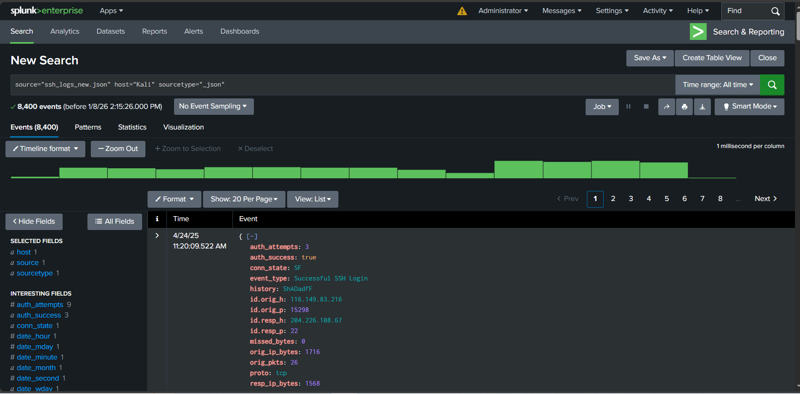
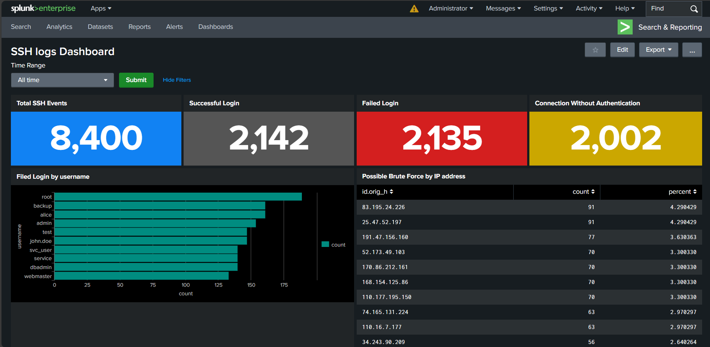
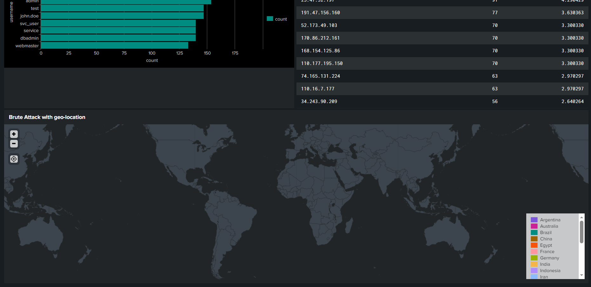

# Splunk-SSH-Logs-Dashboard

A cybersecurity project focused on **SSH authentication analysis** using **Splunk dashboards**.  
This lab demonstrates how to visualize successful and failed logins, detect possible brute-force attacks, and map attacker origins geographically.  

---

## 🎯 Objective  
To create an interactive **Splunk dashboard** that analyzes SSH logs and provides visibility into authentication activity and potential brute-force attempts.  

---

## 🧩 Lab Setup  
- **Tool:** Splunk Enterprise  
- **Dataset:** `ssh_logs.json`, `ssh_logs_new.json`  
- **Host:** `kali`  
- **Sourcetype:** `_json`  

---

## ⚙️ Task 0: Setting up Time Range  

### 🕒 Add Time Range Input  
1. Click on **Add Input**  
2. Select **Time** → click on the **pencil icon**  
3. Set **Label** to `Time Range` and **Token** to `time_range`  
4. Add another input → Select **Submit**  

💡 **Note:** For all future panels, set the time to `time_range` for consistency.  

---

## 📊 Task 1: Authentication Overview Panels  
**Goal:** Give a quick summary of SSH activity.  

### 1️⃣ Total SSH Events  
```spl
source="ssh_logs.json" host="kali" sourcetype="_json"
| stats count AS "Total SSH Events"
```

### 2️⃣ Successful Logins  
```spl
source="ssh_logs.json" host="kali" sourcetype="_json" event_type="Successful SSH Login"
| stats count AS "Successful Logins"
```

### 3️⃣ Failed Logins  
```spl
source="ssh_logs.json" host="kali" sourcetype="_json" event_type="Failed SSH Login"
| stats count AS "Failed Logins"
```

### 4️⃣ Connection Without Authentication
```spl
source="ssh_logs.json" host="kali" sourcetype="_json" event_type="Connection Without Authentication"
| stats count AS "Connection Without Authentication"
```

---

## 📈 Task 2: Login Activity Trends  
**Goal:** Visualize login behavior over time and detect spikes.  

### 1️⃣ Failed Logins by Username (Bar Chart)  
```spl
source="ssh_logs_new.json" host="kali" sourcetype="_json" event_type="Failed SSH Login"
| top username
```

### 2️⃣ Possible Brute Force Attempts (Table)  
```spl
source="ssh_logs_new.json" host="kali" sourcetype="_json" event_type="Multiple Failed Authentication Attempts"
| top id.orig_h
```

---

## 🌍 Task 3: Visualizing Brute Force Attack by Geo-Location  

### Choropleth Map  
```spl
source="ssh_logs_new.json" host="kali" sourcetype="_json" event_type="Multiple Failed Authentication Attempts"
| table id.orig_h
| iplocation id.orig_h
| stats count by Country
| geom geo_countries featureIdField="Country"
```

---

## 🖼 Dashboard Screenshots  








## Conclusion
This project helped me understand how to:

Parse and visualize SSH logs in Splunk
Detect failed and suspicious login patterns
Create dynamic dashboards using shared time filters

## 🔖 Tags

#Splunk #CyberSecurity #SIEM #SSH #SOC #LearningByDoing


